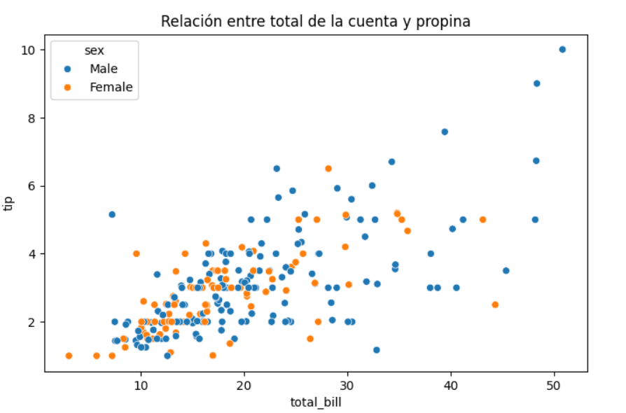
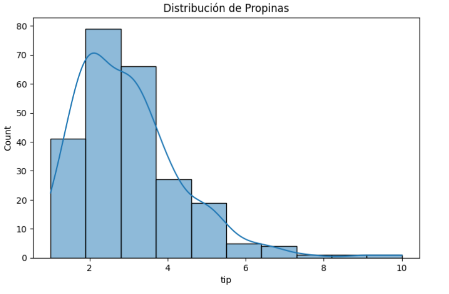
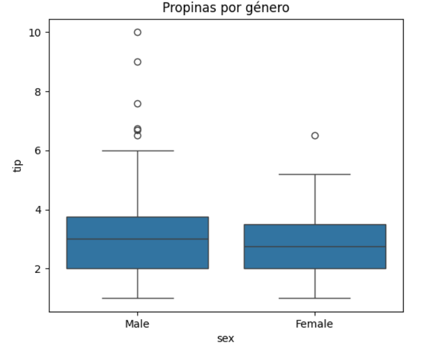
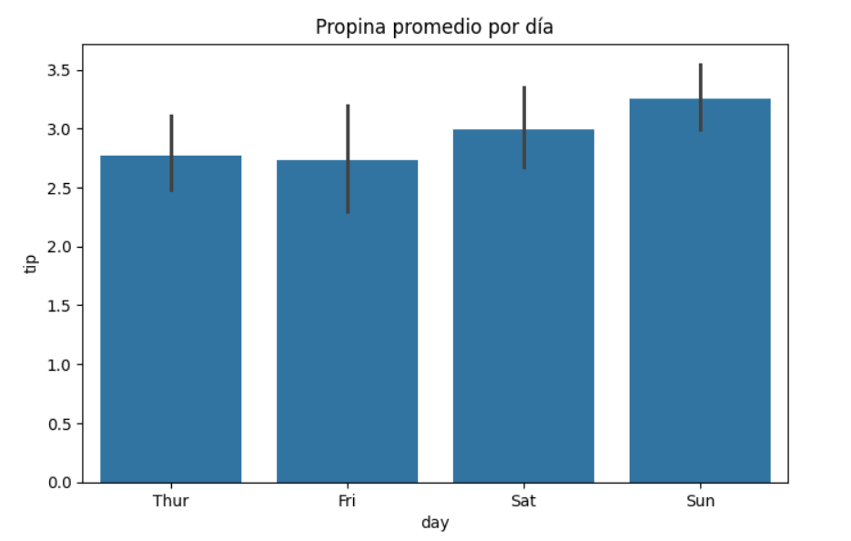
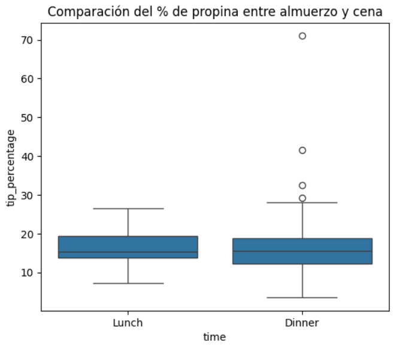

# 📊 Análisis de Propinas con el Dataset "Tips"

Este proyecto analiza los factores que influyen en las propinas en un restaurante, utilizando Pandas, Seaborn y Matplotlib.

## 📂 Contenido
- Exploración y limpieza de datos.
- Visualización de la relación entre propina y otros factores (género, turno, tamaño del grupo, etc.).
- Gráficos con Seaborn y Matplotlib.

## 🔍 Principales Hallazgos
✅ **La propina es mayor durante la cena** en comparación con el almuerzo.  
✅ **Los hombres dejan propinas más altas** que las mujeres en promedio.  
✅ **Las cuentas en la cena son más altas**, lo que influye en el monto de la propina.  
✅ **Los grupos pequeños (1-2 personas) dejan un mayor porcentaje de propina**.  
✅ **No hay una diferencia significativa en la propina entre fumadores y no fumadores**.

## 📊 Visualizaciones  
Aquí algunos gráficos clave del análisis:

  
  
 
 
 

## 🚀 Tecnologías Usadas
- Python 🐍
- Pandas 📊
- Seaborn 🎨
- Matplotlib 📈

## 💡 ¿Cómo usar este proyecto?
1. Descarga el archivo `Mini Proyecto: Análisis de Propinas en un Restaurante.ipynb`.
2. Ábrelo en Google Colab.
3. Ejecuta las celdas para replicar el análisis.

## 📢 Contacto
📩 **jose.miguelhen@gmail.com**  
🔗 [LinkedIn](https://www.linkedin.com/in/jos%C3%A9-miguel-henr%C3%ADquez-arrau-sociologo-fullstack-web/)  

